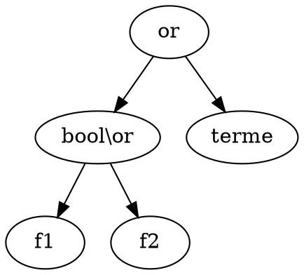

# Laboratoire 8 à 11


## Regex

```Regex
(True|False)
[\+\-]?[0-9]+
[\+\-]?[0-9]+\.[0-9]*

(0?1+)*
((00)+|1(11)+)*
```


Non, car récursif à gauche et l'ordre est défini par l'ordre d'apparition dans les règles

not plus prioritaire car dans la règle la plus bassse

not > and > or

associative à gauche à cause de la récursivité



`Palindrome -> 0 palindrome 0 | 1 palindrome 1`